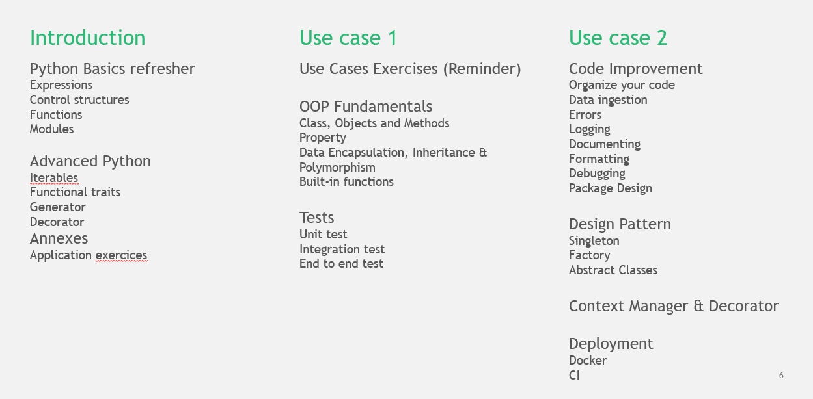

# Software Engineering Training

## Introduction

The objective of this repository is to showcase the implementation of a demand prediction model for a retailer with
the software engineer best practices.
We do not want to focus on what is a good ML model for the problem, but we would like rather to focus and showcase 
what a good code structure, what is necessary to have in production environment, or what make my code robust and reproducible may be for such models.

## Principle & Content

This training is based on an Introduction part and two uses case (UC1 and UC2).
Each part has its own lecture and its own exercises.

### Lecture
The lectures are availables in ```./lecture```

### Exercises
Each branch corresponds to one exercise. You can find the sequences of exercises
in [EXERCISES.md](./EXERCISES.md)
The main branch ```training-se``` is the use case with all exercises completed.

### Agenda


## Prerequisites
To run the Demand Forecast model, you need:
* Docker Engine
* docker-compose

Also:
* If your ports 5432, 5050, 5000 and 8000 are used, either stop the processes using them / adapt the configurations (defined below).
* If you are using Docker for Windows, enable the Expose daemon on tcp://localhost:2375 without TLS option in the General section of your Docker settings. If you are on Mac, tick "Docker for Mac".

#### Docker Engine
If you need to install Docker, you can follow the instruction [here](https://hub.docker.com/signup).
Create an account and select the free individual plan to get started, or just Google "Install Docker" for instructions.
Launch Docker and then check it is working by writing `docker --version` and/or `docker run hello-world` in your command line.

#### Docker-compose
For Windows and Mac, Docker Compose is included as part of the Docker Engine desktop installs.
For Linux systems, follow the instructions [here](https://docs.docker.com/compose/install/).

## Getting started
Please follow these steps the first time, to configure the docker & env:
#### Prepare the working environment
* Clone this git repository on the `training-se` branch: ```git clone git@github.gamma.bcg.com:swe-training/training-se.git```
* Run ```docker-compose up ``` to build the docker image in the repository directory. Make sure everything worked.

#### Set up the core components of the interpreter in PyCharm
* Configure PyCharm by setting up a docker-compose interpreter (you can refer to the instructions [here](https://www.jetbrains.com/help/pycharm/using-docker-compose-as-a-remote-interpreter.html)).
    - Configuring Docker under Build, Execution, Deployment ([Part 1](https://www.jetbrains.com/help/pycharm/using-docker-compose-as-a-remote-interpreter.html#configuring-docker))
        - make sure you map the virtual machine path `/code` to your local path of the repo `training-se`,
    - Add a new docker-compose interpreter ([Part 2](https://www.jetbrains.com/help/pycharm/using-docker-compose-as-a-remote-interpreter.html#docker-compose-remote)): 
        - you select `model` as service 
        - and `python` as python interpreter path.

   - Configure a new run/debug configuration (instructions [Part 3](https://www.jetbrains.com/help/pycharm/creating-and-editing-run-debug-configurations.html)).
        - Make sure to choose a ```python``` new configuration.
        - Point the Script path to ``run.py``.
        - Make sure the python interpreter is pointing to the model service built by docker-compose.
    
 * You are now ready to run the code: test it and make sure it is working so far.

#### Run the model
* Modify `configs/model_config.yaml` if you want to change some parameters
* Click on the run button
* When the message `My job here is done` appears, or `demand_forecast_model_1 exited with code ...`, Ctrl+C to exit
* Access the results in `tmp/demand_prediction/output`

## Configuration
Model and infra configurations are defined in `configuration/model_config.yaml` and `configuration/infra_config.yaml` respectively.

### Infra config: configuration/infra_config.yaml
Allows you to control the configuration for the infrastructure, mostly the port number and the credentials for Postgres.

```yaml
db:
  # [...]
  port: 5432
  # [...]
```

### Model config: configuration/model_config.yaml
Allows you to control the configuration for the model & the run. Comments in the yaml file give detailed instructions.

```yaml
run_info:
  # [...]
  run_mode: "backtest"  # / "live"
  # [...]
```

NB: "live" mode is not supported anymore

### Changing ports
Ports used by docker are defined in `docker-compose.yaml`.

If you change the default port used for `postgres`, you also need to update `configuration/infra_config.yaml` accordingly (this is where the package reads from).

## Web App

### Flask

A flask application is running by default on the port `5000`. To have access to it, go on your browser and type
`http://localhost:5000`

### Postgres & PG Admin

A user-interface for postgres called pgadmin is running by default on the port `5050`.
Pgadmin is available on `http://localhost:5050`.

## Documentation

Find documentation [here](https://github.gamma.bcg.com/pages/swe-training/training-se/).
It includes:
* Getting Started
* Project structure 
* Exercises
* Auto documentation

Or after running the docker services, a sphinx documentation is available [here](http://localhost:8000)

## Tests

If you wish to change the code base, please run the full test stack by executing:

```bash
make test
```

or, if Makefile isn't supported:

```bash
export COMPOSE_FILE_TEST=test/docker-compose.test.yaml
docker-compose -f ${COMPOSE_FILE_TEST} build
docker-compose -f ${COMPOSE_FILE_TEST} up --force-recreate --exit-code-from unit-tests unit-tests  # equivalent to make unit_tests
docker-compose -f ${COMPOSE_FILE_TEST} up --force-recreate --exit-code-from integration-tests integration-tests  # equivalent to make integration_tests
docker-compose -f ${COMPOSE_FILE_TEST} up --force-recreate --exit-code-from e2e-test e2e-test  # equivalent to make e2e_test
docker-compose -f ${COMPOSE_FILE_TEST} down
```

You can also use
```bash
docker-compose -f ${COMPOSE_FILE_TEST} up
```
But the workers will be mixed up and it will be harder to detect what went wrong.
