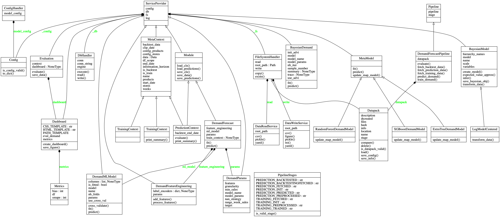

# Demand Forecast - Presentation of the Demo Model

The objective of this repository is to showcase the implementation of a demand prediction model for a retailer.
We do not want to focus on what is a good ML model for the problem, but we would like rather to focus and showcase 
what a good code structure may be for such models.

## What is a good model implementation ?

We are trying to compile on this repository all the good practices we have learned during the demand prediction cases we have worked on.

In our perspective, a good model implementation is an implementation that :

- accelerate on the mid-term the development phase by allowing multiple persons iterating quickly and independently on different parts of the model

- does not present an overhead when trying to deploy and scale the model

- is robust enough thanks to unit and integration tests

- versions the outputs of the model and exposes reports to compare runs and experiments between them


## What are the principles behind a good model implementation ?

The objectives we are trying to aim on the previous section are achieved by using mostly concepts coming from the software engineering world. 
after all, we are writing code !

#### Loose coupling
Loose coupling between the different modules of the system is the key.

For example:

Data management code should be separated as extremely as possible from the model code.  

The learning and prediction steps should be separated.

The backtesting module should be separated from the prediction module.

The main advantage of loosely coupled systems is that its components can be replaced with alternative implementations that provide the same service, 
which is highly desirable expecially on Machine Learning where we want to replace the "prediction service" with different implementations easily

#### Clear interfaces between the components of the system
Loose coupling can only be achieved if the interfaces between the different modules are cristal clear ahead of the start of the project.  

Having clearly defined interfaces helps also reduce the mutual dependancy between team members and helps accelerate projects where many developers are involved.  
In this case, the interfaces work as contracts between the developers that they need to respect in order to be able to work together.


#### A Machine Learning Model is a DAG
We have to reason about a ML model as a dag that takes as inputs the data, the config(s), a code version and that produces an output.

The nature of the output is different if we are in the developement or deployment phase. 

On development, the output is generally a dashboard summarizing the model performances on backtest.

On deployment, the output can be either predictions that will be exposed to the model user or exposed through an api for live predictions.

Many tools such as `Airflow`, `Luidgi` or simple `Makefiles` can help orchestrating the dag 

#### Model results are replicable
For this, we need to ensure that the same inputs lead to the same outputs


## The example we are dealing with on this demo project

We will assume in this project that we are working with a grocery retailer who has 10 stores, selling different products 100.

Our client needs to better manage his supply chain by buying from his suppliers only the quantity needed on the near future. 
This will help him reduce his stock, reduce his costs and improve his margin.
There is a lead time of 3 weeks in order to get the deliveries from the suppliers.


In order to achieve that, the client needs to forecast the demand between weeks `t+3` and `t+7`, using data before time `t` where `t` is the time where the model is run.


# Structure of Demand Forecast Module

## Project Organization


    ├── LICENSE
    ├── Makefile                <- Makefile with commands like `make data` or `make train`
    ├── README.md               <- The top-level README for developers using this project.
    │
    ├── doc                     <- A default Sphinx project; see sphinx-doc.org for details
    │
    ├── requirements.txt        <- The requirements file for reproducing the analysis environment, e.g.
    │                           generated with `pip freeze > requirements.txt`
    │
    ├── configs                 <- Contains configuration files used in pipeline
    │   ├─ infra_config.yaml    <- Configuration of the infrastructure
    │   └─ model_config.yaml    <- Model configuration
    │
    ├── src                     <- Source code for use in this project.
    │   ├─ __init__.py          <- Makes src a Python module
    │   │
    │   ├─ backtest             <- Folder used in backtest mode to evaluate prediction
    │   │  ├─ dashboard.py      <- Generate HTML page
    │   │  ├─ evaluate.py       <- Scripts used to perform evaluation and create dashboard
    │   │  └─ utils.py          <- Utils functions needs for the backtest module
    │   │
    │   ├─ context              <- Folder used to define context objects
    │   │  ├─ meta.py           <- Meta context for the prediction and the training context
    │   │  ├─ prediction_context.py <- Prediction context
    │   │  └─ training_context.py <- Training context
    │   │
    │   ├─ data                 <- Scripts to download or generate data
    │   │  ├─ data_fetch        <- Scripts to query data in database
    │   │  └─ mock_data         <- Scripts to generate mock data for project
    │   │
    │   ├─ demand_forecast      <- Folder containing scripts to run demand training and prediction
    │   │  ├─ ml_model          <- Folder to define demand machine learning models
    │   │  ├─ params            <- Folder to define demand module parameters
    │   │  ├─ processing        <- Folder to define features engineering scripts
    │   │  ├─ meta.py           <- Folder to save or load object
    │   │  └─ demand_forecast.py
    │   │
    │   ├─ services             <- Folder containing infra services used in pipeline
    │   │  ├─ filesystem        <- Scripts to manage filesystem
    │   │  ├─ config            <- Scripts to handle configuration file access 
    │   │  ├─ db                <- Scripts to handler database connection
    │   │  ├─ log               <- Scripts to handler logs
    │   │  └─ service_provider.py <- Script to Manager filesystem, config, db and log
    │   │
    │   ├─ tasks                <- Scripts containing tasks corresponding to pipeline logic
    │   │  ├─ demand_forecast.py<- Script to define the main Operator in the pipeline
    │   │  ├─ pipeline.py       <- Scripts to define Pipeline object
    │   │  ├─ operators.py      <- Scripts to define operator object
    │   │  └─ stages.py         <- Scripts to define stage object
    │   │
    │   ├─ utils                <- Scripts useful for whole pipeline
    │   │  ├─ func_utils.py     <- Scripts to define useful function needed in the module
    │   │  └─ cli.py            <- Scripts to define command line interface
    │   │   
    │   └─ test  
    │       ├─ data_test        <- Scripts to store testing data
    │       ├─ unit_tests       <- Scripts to do the unit tests
    │       └─ integration_tests<- Scripts to do integration tests   
    │
    ├── tmp                     <- Temporary folder where are stored pipeline data
    │   
    ├── Dockerfile              <- Dockerfile used to build model image
    │    
    ├── run.py                  <- Script to run Demand Foreast Module
    │   
    ├── docker-compose.yaml     <- Manage docker services such as database, pgadmin and model
    │   
    └── tox.ini                 <- tox file with settings for running tox; see tox.testrun.org


--------
## UML



## Main Modules

### Service

#### Description

Service is the module that allows to handle the log, the database, the config and the filesystem.
The goal of this script is to make these 4 services unique even if one of these classes will be instantiated several times.
The Singleton method allows to keep the service unique along the `Demand Forecast` module.


#### How to use it 

````python
from src.services.service_provider import ServiceProviderHandler

SERVICES = ServiceProviderHandler()

class Foo:

    def __init__(self):
    
        self.bar = SERVICES.config.name
        SERVICES.log.info('New class instanciated')
````

### Task

#### Description

The Task module handles the pipeline of the run and manages all the different steps.

This module consists of :
 - `stages` submodule that defines the `Stage` object. Stages are defined sequentially and are specific to the demand forecast use case.
 One Stage corresponds to a specific step of the pipeline. This object is instantiated with a name like `"TRAINING_FETCH"`
 and contains comparison methods like `__eq__`, `__gt__`, ... to use the following operator on the `Stage` object : 
 `stage_a < stage_b`
 
 - `operators` submodule that defines the `Òperator` object. An operator is a step in a pipeline, that executes a task, 
 given a configuration, a stage and data, and updates the stage. Operators have dependencies (on other operators / on the stage).
An operator  is defined with an `operator_id`, a `final_stage` and a function `python_callable`
 
 - `pipeline` submodule that defines the `Pipeline` object. A `Pipeline` is a set of tasks (`Operator`) organized with dependencies.
Running a Pipeline will execute the Operators according to their dependencies.
Here, dependencies are linear and linked to `Stages`: the Pipeline starts from a `begin_stage`,
then executes each `Operator` and moves to the next stage and ends to a `final_stage`.
A Pipeline run in test mode will trigger a check of the Operator's output against a reference Scenario.

 - `demand_forecast` submodule that defines the `DemandForecastPipeline`. This module defines first all the methods that
  will be run sequentially. And from a method and a final_stage, an operator is defined. 
  The `DemandForecastPipeline` inherits from the `Pipeline` class and is instantiated with the list of Operators defined at
  the beginning of this submodule.
  
#### How to use it

````python
from src.services.service_provider import ServiceProviderHandler
from src.tasks.operators import Operator
from src.tasks.pipeline import Pipeline
from src.tasks.stages import DFStages, Stage

# Define method to run in the pipeline
def method_a():
    print("Start")

# Define the corresponding stage
stage_a = Stage("INIT")

# Define the corresponding operator
operator_a = Operator(
    operator_id="operator_a",
    final_stage= stage_a,
    python_callable=method_a
)

# Define another method
def method_b():
    print("Ends")

stage_b = Stage("END")

operator_b = Operator(
    operator_id="operator_b",
    final_stage= stage_b,
    python_callable=method_b
)

# Create the operator list, basis of the pipeline
operators_  = [ operator_a, operator_b]    

# Instantiate the pipeline
myPipeline = Pipeline(
    begin_stage=stage_a,
    final_stage= stage_b,
    operators=operators_,
    test=False
)

# Run the pipeline
myPipeline.run()

````
 
### Scenario

#### Description

The `Scenario` object is a simple data versioning system of your runs and allows to manage your different scenarios by saving
the corresponding data and config. It is based on a directory where the config, the run information  and the output data are stored.
The scenario object has these following properties : 
  - `name`
  - `locations` 
  - `hash`
  - `dtcreated` 
  - `stage`
  - `git_hash` 
  - `config`
 
This Scenario object allows as well to make the output replicable.
  
This class allows to load directly a scenario and compare two different scenarios on :
config, code, data, model, score,...

#### How to use it

````python
from src.services.filesystem.scenario import Scenario
from src.services.config.config_handler import Config

config = Config("./config/model_config.yml")

# Instantiate a new scenario
new_scenario = Scenario(
        input_path="./tmp",
        config=config
)

# Load an existing scenario
loaded_scenario = Scenario.load(
        scenario_path="./tmp/demand_prediction_1"
)

# Compare two scenarios
check = new_scenario.compare(loaded_scenario)

````


### Demand Forecast

#### Description

The demand_forecast module handles the ML model and the final data processing module.

1. The `model` submodule includes all the predefined or custom-made ML model. A model factory allows
to easily change and test different model only based on a model name (in the config). This factory is defined in the
`MetaModel` object with a `fit` and a `predict` method.

2. The `params` submodule contains all parameters necessary for the training model.

3. The `processing` submodule contains all methods necessary for the feature engineering.


### Context

The context module defines context objects used in the Demand Forecast module. A context defines a scope
( i.e which stores, which products) for the model with a specific time windows, or a special mode (e.i backtest).


Two mains contexts are used in the module :

 1. Training Context : 
 
    Scope of the training data. 
    ```
    Training context example:
    
          | ----------TRAINING---------- | ----------VALIDATION----------- |
      2018-12-28----------8----------2019-02-21----------6----------2019-04-04

    Store ID : [1, 2, 3, 4, 5, 6, 7, 8, 9, 10]
    
    Number of product : 100
    
    ```
 
 2. Prediction Context  : 
 
    Scope of the prediction data. It includes the backtesting context if `backtest` is enabled.
    
    ```
    Prediction Context :
    
        | ----------PREDICTION---------- | ----------BACKTEST---------- |
    2019-04-05----------8----------2019-05-30----------6----------2019-07-11

    Store ID : [1, 2, 3, 4, 5, 6, 7, 8, 9, 10]
    
    Number of product : 100

    ```
 

### Backtest

Backtest module evaluates the score of the prediction on the actual data. The score is based on the BIAS and the SMAPE 
value.

This module generates an HTML page that will feed the Flask app.

### Run

#### Description

`run.py` triggers the full run of Demand Forecast. Optional Arguments can be added :
 - `-d`, `--scenario`, input path of a scenario, `default = None`. If the arguments is None, the run will instantiate a new scenario.
 - `-n`, `--name`, name of the scenario.
 - `-s`, `--final_stage`, final stage of the run, `default = PREDICTION_BACKTESTED`. If the arguments is None, the script will execute the full.
 
 Basically, the `run.py` script will :
  - instantiate a new config, 
  - set up and read the CLI
  - instantiate a new scenario 
  - instantiate a new pipeline 
  - execute `pipeline.run()`
 
 
 #### How to use it
 
 ````python
 
 import importlib
import logging
import pathlib

from src.services.config.config_handler import ConfigHandler
from src.services.filesystem.scenario import Scenario
from src.services.service_provider import ServiceProviderHandler
from src.utils.cli import cli_set_up, cli_read


# 1. Set the config
config = ConfigHandler(yaml_directory=pathlib.Path(
    __file__).resolve().parent / "configs")

# 2. Set up the CLI
parser = cli_set_up()

# 3. Read the CLI
scenario_path, final_stage = cli_read(parser=parser)

# 4. Instanciate scenario (load if the input path is not none)
if scenario_path is not None:
    scenario = Scenario.load(scenario_path=scenario_path)
else:
    scenario = Scenario(input_path="./tmp", config=config.model_config)

# 5. Define Service
SERVICE = ServiceProviderHandler()

# 6. Define the pipeline
dfp = importlib.import_module("src.tasks.demand_forecast")
DEMAND_FORECAST_PIPELINE = dfp.DemandForecastPipeline(
    scenario=scenario,
    begin_stage=scenario.stage,
    final_stage=final_stage,
    test=False)

# 7. Run pipeline
SERVICE.log.info("\033[1mStarting the pipeline\033[0m")
DEMAND_FORECAST_PIPELINE.run()
SERVICE.log.info("\033[1mMy job here is done\033[0m")
scenario.delete(disk=False)

````
